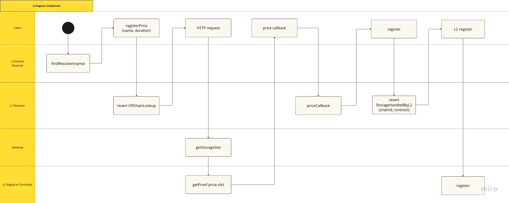
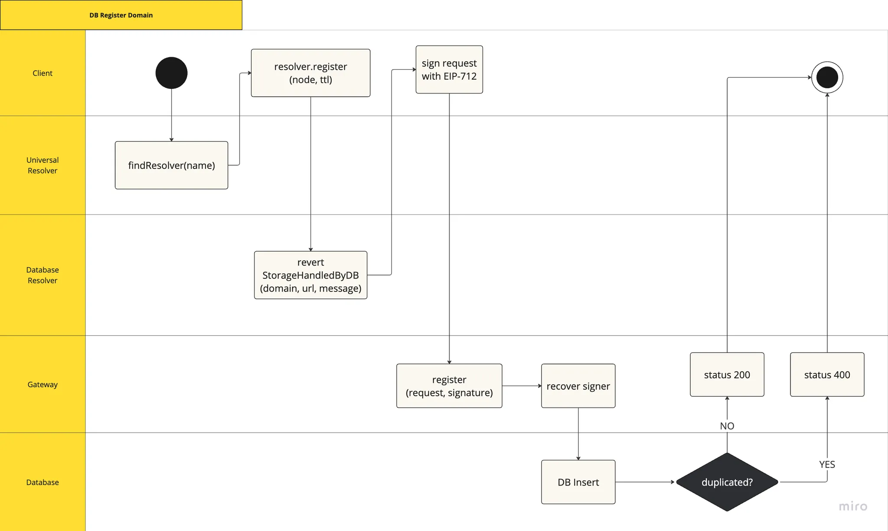

# ENSIP - Wildcard writing

---

> ensip: <TBD>
> 
> 
> title: Wildcard Writing
> description: A standardized implementation for managing offchain domains using an External Resolver
> author: Lucas Picollo (@pikonha), Alex T. Netto (@alextnetto)
> discussions-to: <URL>
> status: Draft
> type: Standards Track
> category: ERC
> created: 2024-08-14
> requires: 5559
> 

## Abstract

This ENSIP proposes a standardized Offchain Resolver interface for managing offchain domains within the Ethereum Name Service (ENS) ecosystem. It addresses the growing trend of storing domains off the Ethereum blockchain to reduce transaction fees while maintaining compatibility with existing ENS components. The proposal outlines methods for domain registration, transferring, and setting records, ensuring a consistent approach to offchain domain management.

## Motivation

With the acceptance of CCIP-Read by the Ethereum community, there has been a notable shift towards storing domains in locations other than the Ethereum blockchain to avoid high transaction fees. This shift has revealed a significant gap: the lack of standardized methods for managing offchain domains. By establishing a standardized offchain resolver implementation and user flow, we can ensure a consistent approach to offchain domain management, enabling applications that support this EIP flow to integrate this feature and enhance user experience seamlessly, increasing scalability and providing cost-effective solutions.

## Specification

### Database Implementation Considerations

All supported offchain writing calls MUST rely on EIP-5559, specifying the custom error `StorageHandledByOffChainDatabase`. This error MUST return all required values to implement the EIP-712 signature, ensuring domain ownership.

### L2 Implementation Considerations

Following EIP-5559, this specification MUST support implementation on Layer 2 solutions. The specification describes the writing strategy for L2 relying on the custom error `StorageHandledByL2` with the following arguments:

1. **Chain ID**: the chain ID of the L2 network where the contract is deployed.
2. **Contract Address**: the address of the contract on the L2 network.

### Subdomain registering

**Register parameters**

As the initial step in registering an offchain subdomain, the `registerParams` function has been implemented to support a wide variety of use cases. This function plays a crucial role in creating a flexible and extensible offchain subdomain registration system.

Given that this step relies on the CCIP-Read standard, this interface SHALL only be implemented by the resolver deployed to Ethereum since it won't be gathering the data through the function call on layer 2, but by directly accessing the storage layout of the given contract.

The function has the following signature:

```solidity
struct RegisterParams {
    uint256 price;
    bytes extraData;
}

function registerParams(
    bytes memory name,
    uint256 duration
)
    external
    view
    returns (RegisterParams memory);
```

Parameters:

- `name`: The DNS-encoded name to query
- `duration`: The duration in seconds for the registration

Return:

- `price`: the amount of ETH charger per second
- `extraData`: any given structure in an ABI encoded format

Sample of callback function used to validate and handle the response returned by the L2 contract:

```solidity
function registerParamsCallback(
    bytes[] memory values,
    bytes memory extraData
)
    public
    pure
    returns (RegisterParams memory)
{
    return abi.decode(values[0], (RegisterParams));
}
```

**Register subdomain**

Aiming to integrate with the already existing interface of domain registration, the register function MUST have the following signature:

```solidity
function register(
    string calldata name,
    address owner,
    uint256 duration,
    bytes32 secret,
    address resolver,
    bytes[] calldata data,
    bool reverseRecord,
    uint16 fuses
) external payable;
```

Parameters:

- `name`: DNS-encoded domain
- `owner`: subdomain owner's address
- `duration`: the duration in miliseconds of the registration
- `secret`: random seed to be used for commit/reveal
- `resolver`: the address of the resolver to set for this name.
- `data`: multicallable data bytes for setting records in the associated resolver upon registration
- `fuses`: the nameWrapper fuses to set for this name

Behavior:

- When implemented by the resolver deployed to the Ethereum network it MUST revert with the respective error, providing necessary data for offchain processing.
- When implemented by the contract responsible for issuing subdomains on the given layer 2 it MUST register the subdomain.
- Both implementations should include appropriate access controls and emit events for transparency.

### Transfer Domain

The interface for enabling domain transfers MUST be implemented by both the resolver deployed to Ethereum and the contract responsible for managing domains deployed on the layer 2. The implementation differs between L1 and L2 as follows:

1. **L1 Resolver**: MUST revert with the respective error described by EIP-5559, indicating that the actual transfer should occur elsewhere.
2. **L2 Contract**: MUST handle the actual domain transfer operation.

The transfer function MUST have the following signature:

```solidity
function transfer(bytes32 node, address owner) external;
```

With the arguments being:

1. `node`: a valid ENS node (namehash).
2. `owner`: an Ethereum address.

Security Considerations

- The function SHOULD include appropriate access controls to ensure only authorized parties (e.g., the current owner) can initiate transfers.
- Implementations should consider emitting events to log transfer operations for transparency and off-chain tracking.

### Set records `multicall`

This function MUST be implemented to support batch operations on ENS records, providing a gas-efficient and convenient way to update multiple aspects of a domain or subdomain simultaneously.

The `multicall` function MUST have the following signature:

```solidity
function multicall(bytes[] calldata data) external returns (bytes[] memory);
```

Parameters

- `data`: An array of bytes, where each element represents an encoded function call.

Behavior:

- The L1 contract should use EIP-5559 to redirect the `multicall` operation to the appropriate off-chain or L2 system.
- The off-chain or L2 implementation should process the batch operations and update the records accordingly.
- Events should be emitted to allow off-chain indexers to track changes and maintain consistency with on-chain state.

## Rationale

The proposed Offchain Resolver standardizes the management of offchain domains within the ENS ecosystem. By leveraging EIP-5559 for offchain writing and maintaining compatibility with existing ENS components, this proposal ensures a seamless integration of offchain domain management into current ENS workflows.

The use of reverts with custom errors allows for a consistent handling of offchain requests, while the implementation of standard ENS resolver functions ensures compatibility with existing ENS tools and interfaces.

### Architecture

The proposed flow is designed to make the Resolver deployed on the L1 responsible for redirecting the requests to the given offchain storage, enabling the communication of any dapps (e.g. ENS dapp) in a standard way.



L2 subdomain registering



Database subdomain registering

## Backwards Compatibility

This ENSIP introduces new functionality relying on an mechanism similar to what is being used on the CCIP-Read standard. However, it requires the EIP-5559 to change its behavior from having a intermediary structure to revert with the full `msg.data` provided by the client. This change is described on Appendix 1 and it's being discussed in the [following issue](https://ethereum-magicians.org/t/eip-5559-cross-chain-write-deferral-protocol/10576/13).

## Reference Implementation

A reference implementation of the Offchain Resolver is provided in Appendix 1. This implementation includes the core functions `registerParams`, `register`, `transfer`, and `multicall`, along with the necessary error handling for offchain storage.

For L2 implementation, a separate reference implementation will be provided, showcasing:

1. Integration with a popular L2 solution (e.g., Optimism or Arbitrum)
2. Implementation of `StorageHandledByL2` error handling
3. Integration with existing L2 domain issuers such as Base, Linea and Namespace.

These reference implementations will be made available in a separate repository.

## Security Considerations

### Database

1. The authentication logic for domain ownership is shifted entirely to the signing step performed by the Client. Implementations MUST ensure robust signature verification to prevent unauthorized access or modifications.
2. The Gateway that receives redirected calls is responsible for ownership validation. Proper security measures MUST be implemented in the Gateway to prevent unauthorized actions.
3. The use of EIP-712 signatures for authentication provides a secure method for verifying domain ownership. However, implementers SHOULD be aware of potential signature replay attacks and implement appropriate mitigations.
4. The offchain storage of domain information introduces potential risks related to data availability and integrity. Implementers SHOULD consider redundancy and data verification mechanisms to mitigate these risks.
5. The `multicall` function allows for batch operations, which could potentially be used for denial-of-service attacks if not properly rate-limited or gas-optimized. Implementations SHOULD include appropriate safeguards against such attacks.

### L2

1. **L2 Security Model**: Implementations on L2 MUST consider the security model of the chosen L2 solution. This includes understanding the dispute resolution mechanisms, data availability guarantees, and potential vulnerabilities specific to the L2 platform.
2. **Cross-layer Attacks**: Implementers MUST be aware of potential attack vectors that could arise from cross-layer interactions. Proper validation and synchronization mechanisms SHOULD be implemented to prevent exploitation of differences between L1 and L2 states.
3. **L2 Exits**: For L2 implementations, secure exit mechanisms MUST be provided to allow users to withdraw their domain ownership and data back to L1 in case of L2 failure or other emergencies.
4. **Data Availability Challenges**: L2 implementations MUST have robust mechanisms to ensure that crucial ENS data remains available and verifiable on L1, even in scenarios where the L2 network faces challenges or downtime.

Further security analysis and auditing are RECOMMENDED before deploying this system in a production environment, with special attention given to the unique security considerations of both database and L2 implementations.

## Appendix

### Appendix 1: Offchain Storage Implementation with EIP-5559 changes

Although EIP-5559 is still under community discussion, it would be a huge improvement if the parameters were encoded as native bytes format, changing the `parameters` struct to the encoded calldata in `bytes` format and removing the type cast library from the contract. The `StorageHandledByOffChainDatabase` revert implementation as specified by EIP-5559:

```solidity
// current IWriteDeferral implementation
struct messageData {
  bytes4 functionSelector;
  address sender;
  parameter[] parameters;
  uint256 expirationTimestamp;
}

// proposed IWriteDeferral implementation
struct messageData {
  bytes callData; // encoded version of function signature and its arguments
  address sender;
  uint256 expirationTimestamp;
}
```

```solidity
/**
 * @notice Builds a StorageHandledByOffChainDatabase error.
 * @param params The offChainDatabaseParamters used to build the corresponding mutation action.
 */
function _offChainStorage(IWriteDeferral.parameter[] memory params)
    private
    view
{
    revert StorageHandledByOffChainDatabase(
        IWriteDeferral.domainData({
            name: _WRITE_DEFERRAL_DOMAIN_NAME,
            version: _WRITE_DEFERRAL_DOMAIN_VERSION,
            chainId: _CHAIN_ID,
            verifyingContract: address(this)
        }),
        gatewayUrl,
        IWriteDeferral.messageData({
            callData: msg.data,
            sender: msg.sender,
            expirationTimestamp: block.timestamp
                + gatewayDatabaseTimeoutDuration
        })
    );

```

### Appendix 2: CCIP-Store

Even though the recently proposed offchain writing strategy specified in [EIP-7700](https://eips.ethereum.org/EIPS/eip-7700#database-router-storageroutedtodatabase) handles the signature step differently, the current `register` signature is still a fully compliant way of registering a new domain.

### Appendix 3: IOffchainResolver interface

```solidity
// SPDX-License-Identifier: MIT
pragma solidity ^0.8.4;

/**
 * @title IOffchainResolver Interface
 * @dev Interface for a resolver that supports text and address records management, with additional functions for registration, ownership transfer, and multicall.
 */
interface IOffchainResolver {

    /**
     * Forwards the registering of a domain to the L2 contracts
     * @param name The DNS-encoded name to resolve.
     * @param owner Owner of the domain
     * @param duration The duration in seconds of the registration.
     * @param resolver The address of the resolver to set for this name.
     * @param data Multicallable data bytes for setting records in the associated resolver upon reigstration.
     * @param fuses The fuses to set for this name.
     */
    function register(
        string calldata name,
        address owner,
        uint256 duration,
        bytes32 secret,
        address resolver,
        bytes[] calldata data,
        bool reverseRecord,
        uint16 fuses
    )
        external
        payable;

	  /**
	   * @dev Struct to hold registration parameters
	   */
	  struct RegisterParams {
	      uint256 price;
	      bytes extraData;
	  }
	
	  /**
	   * @notice Returns the registration parameters for a given name and duration
	   * @param name The DNS-encoded name to query
	   * @param duration The duration in seconds for the registration
	   * @return RegisterParams struct containing registration parameters
	   */
	  function registerParams(
	      bytes memory name,
	      uint256 duration
	  )
	      external
	      view
	      returns (RegisterParams memory);

    /**
     * @notice Transfers ownership of an ENS node to a new owner.
     * @param node The ENS node to transfer.
     * @param owner The address of the new owner.
     */
    function transfer(bytes32 node, address owner) external;

    /**
     * @notice Executes multiple calls in a single transaction.
     * @param data An array of encoded function call data.
     */
    function multicall(bytes[] calldata data) external returns (bytes[] memory);
}
```